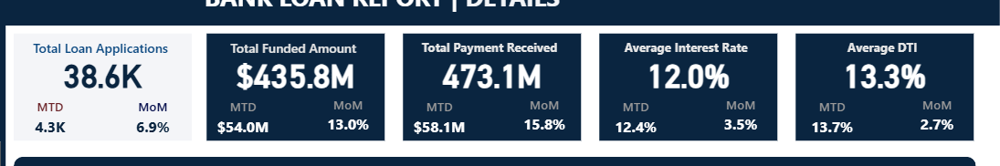

# 📊 Bank Loan Analysis Dashboard (Power BI)

## 📌 Project Overview
This project is an **end-to-end Power BI data analytics project** focused on **bank loan analysis** in the finance domain.  
The goal is to analyze loan data to understand **loan approval trends, funded amounts, repayments, loan purpose, and risk insights** using interactive dashboards.

---

## 🎯 Objectives
- Analyze **total loan applications**
- Track **funded amount vs amount received**
- Identify **good loans vs bad loans**
- Understand loan trends across **time, regions, and purpose**
- Build an **interactive and professional Power BI dashboard**

---

## 🧰 Tools & Technologies Used
- **Power BI Desktop**
- **Power Query** (Data Cleaning & Transformation)
- **DAX** (Measures & Calculations)
- **SQL** 
- **CSV Dataset**

---

## 📂 Dataset
The dataset contains bank loan-related information such as:
- Loan amount
- Interest rate
- Loan status
- Issue date
- Purpose of loan
- Borrower details (employment length, home ownership, etc.)

---

## 📊 Dashboard Features
- **KPI Cards**
  - Total Loan Applications
  - Total Funded Amount
  - Total Amount Received
  - Average Interest Rate
  - Average Debt-to-Income Ratio (DTI)

- **Loan Performance Analysis**
  - Good Loans vs Bad Loans
  - Loan Status Distribution

- **Trend Analysis**
  - Monthly loan applications
  - Funded amount over time

- **Borrower Insights**
  - Loan purpose analysis
  - Home ownership vs loan status
  - Employment length analysis

- **Interactive Filters**
  - Date slicers
  - Loan grade
  - Loan status

---

## 🖼️ Dashboard Screenshots
### KPIs

> Overview Dashboard
> Summary Dashboard
> Detail Dashboard

## 🛠️ Data Preparation Steps
1. Imported CSV data into Power BI
2. Cleaned and transformed data using **Power Query**
3. Created calculated columns and measures using **DAX**
4. Designed interactive visual dashboards

## 📈 Key Insights
- Majority of loans fall under **fully paid** category
- Certain loan purposes show higher default rates
- Loan applications increase significantly in specific months
- Borrower employment length impacts loan approval trends

  ## 🚀 How to Use This Project
1. Clone this repository
2. Open the `.pbix` file using **Power BI Desktop**
3. Refresh data if required
4. Explore dashboards using slicers and filters

This project is inspired by and implemented by following this tutorial:  
🎥 **Power BI Complete Tutorial | Bank Loan Analysis Project**  
https://youtu.be/3I8wd1AShXs

## 📬 Contact
**Author:** Lin Khant  
💼 Aspiring Data Analyst / BI Developer  
🌱 Learning Power BI, SQL, and Data Analytics  

